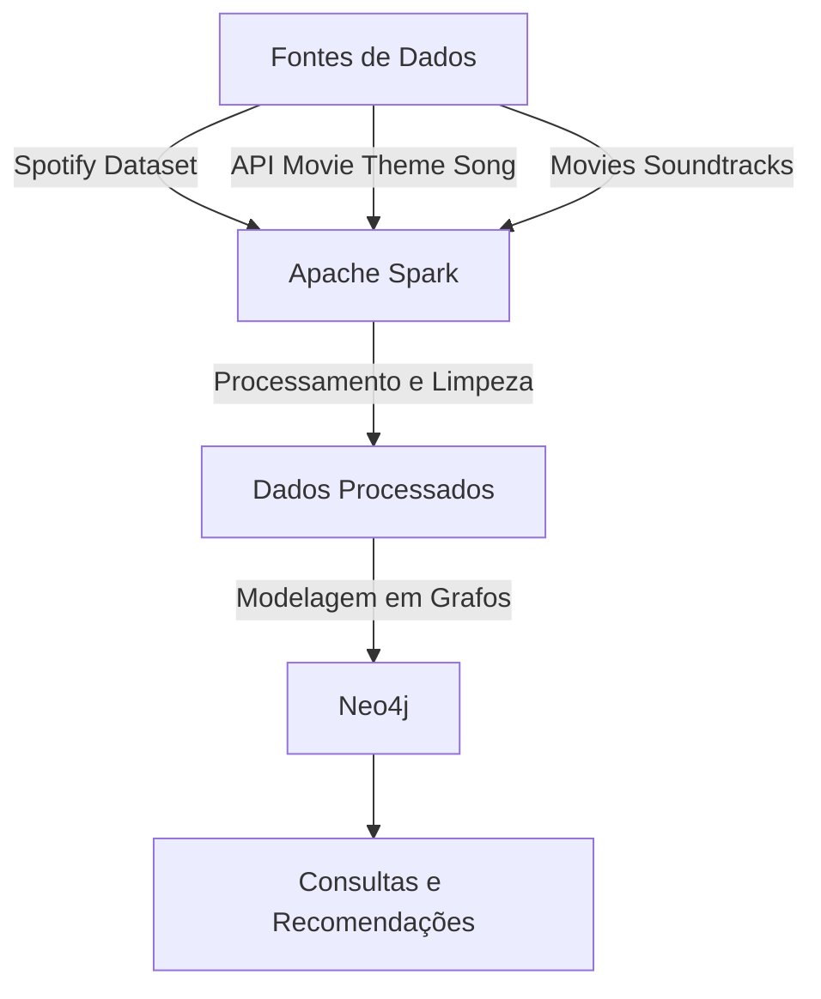

# UFSCAR-CC-So-PMD2025-Grupo05

770988 - Arthur Naoto Nitto

802640 - Beatriz Patricio Santos

801695 - Murillo Justino dos Santos

---

O objetivo deste projeto é desenvolver uma aplicação de recomendação de filmes e músicas baseada na relação entre eles. A aplicação será capaz de recomendar músicas relacionadas a um filme específico e vice-versa. Para isso, utilizaremos três bases de dados que contêm informações sobre músicas do Spotify, trilhas sonoras de filmes e séries, e temas de filmes.

## Tecnologias Escolhidas

- **Apache Spark**:  
Será utilizado para o processamento massivo dos dados pois é uma ferramenta poderosa para realizar transformações, limpezas e junções de grandes volumes de dados de forma eficiente, portanto será importante para a etapa de preparação dos dados.

- **Neo4j**:  
Será utilizado para modelar os dados em grafos, o que é ideal para mapear as relações entre os filmes, músicas e seus atributos. Ele permitirá consultas complexas e rápidas, o que é essencial para a aplicação de recomendação.

## Fontes de Dados
- **Spotify Dataset**: [Link para o dataset](https://www.kaggle.com/datasets/devdope/900k-spotify)  
  Este dataset contém informações sobre aproximadamente 900 mil músicas disponíveis no Spotify e contém atributos como nome da música, artista, álbum, gênero, emoção, duração, entre outros. Utilizaremos para obter informações detalhadas sobre as músicas e suas características.
- **API Movie Theme Song**: [Link para a API](https://github.com/atlexis/movieThemeSongDatabase?tab=readme-ov-file)  
  Esta API fornece informações sobre músicas tema de filmes. Inclui dados como o nome do filme, ano de lançamento, título da música tema, artista, entre outros.
Utilização: Utilizaremos esta API para relacionar as músicas com os filmes em que elas apareceram. Uma informação importante que essa API retorna é o código da música no Spotify, com ele podemos obter um link direto para a música na plataforma. Também podemos obter o código IMDB do filme.
- **Movies Soundtracks**: [Link para o dataset](https://www.kaggle.com/datasets/ravineesh/soundtracks-of-top-250-imdb-movies-and-tv-series)  
  Este dataset contém informações sobre trilhas sonoras de filmes e séries do IMDb Top 250. Inclui dados como o nome do filme ou série, ano de lançamento, título da música, artista, entre outros. Utilizaremos este dataset de maneira complementar para obter informações sobre as trilhas sonoras de filmes e séries populares e estabelecer a relação entre os dados do Spotify.

## Fluxograma do Projeto

## Descrição do Fluxograma
1. **Fontes de Dados**: As três bases de dados serão utilizadas como fontes de informação.
2. **Apache Spark**: O Spark será responsável por processar e limpar os dados, realizando transformações e junções necessárias.
3. **Dados Processados**: Os dados processados pelo Spark serão preparados para a modelagem em grafos.
4. **Neo4j**: Os dados processados serão inseridos no Neo4j, onde serão modelados em grafos para mapear as relações entre filmes, músicas e seus atributos.
5. **Consultas e Recomendações**: Realizar consultas e gerar recomendações de filmes e músicas baseadas nas relações mapeadas.

## Consultas Definidas
- Recomendação de músicas baseadas em um filme específico.
- Recomendação de filmes baseados em uma música específica.
- Exploração das relações entre filmes e músicas, como diretores, artistas, gêneros, emoção etc:
    - Encontrar músicas que trazem uma emoção específica
    - Encontrar filmes que possuem músicas de um artista específico
