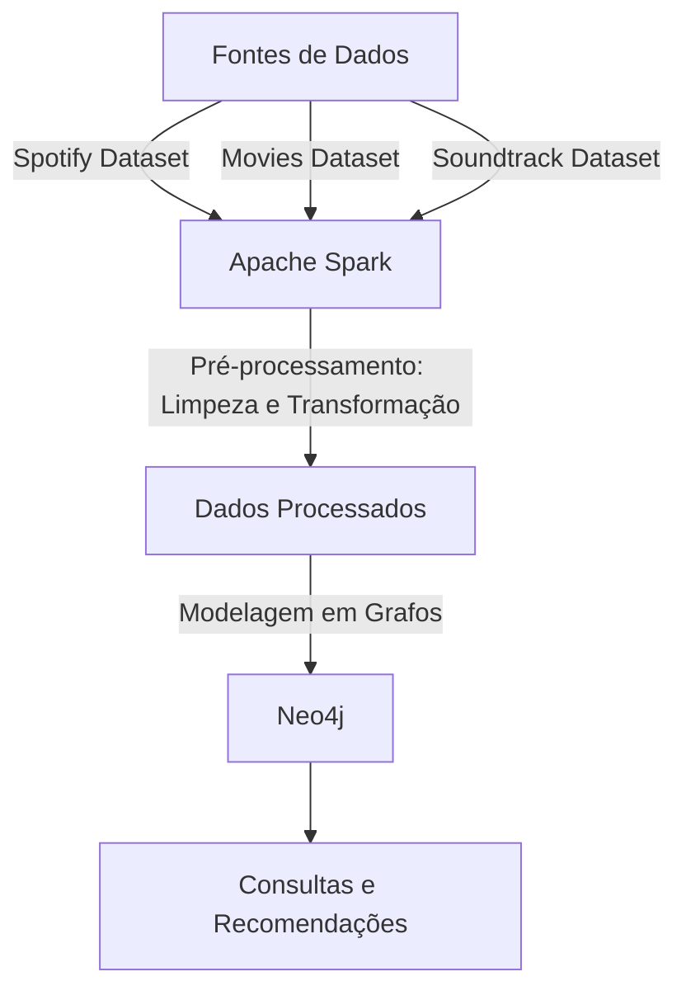

# UFSCAR-CC-So-PMD2025-Grupo05

770988 - Arthur Naoto Nitto

802640 - Beatriz Patricio Santos

801695 - Murillo Justino dos Santos

---
## Objetivo
O objetivo deste projeto é desenvolver uma aplicação de recomendação de filmes e músicas, tanto separadamente quanto o relacionamento entre ambos. A aplicação será capaz de recomendar músicas relacionadas a um filme específico e vice-versa. Para isso, utilizaremos duas bases de dados que contêm informações sobre músicas do Spotify e informações de filmes.

## Tecnologias Escolhidas

- **Apache Spark**:  
Será utilizado para o processamento massivo dos dados pois é uma ferramenta poderosa para realizar transformações, limpezas e junções de grandes volumes de dados de forma eficiente, portanto será importante para a etapa de preparação dos dados.

- **Neo4j**:  
Será utilizado para modelar os dados em grafos, o que é ideal para mapear as relações entre os filmes, músicas e seus atributos, diferentemente de outros modelos (MongoDB possui dificuldade em mapear relacionamentos e em SQL as operações de JOIN são custosas). Ele também oferece suporte para um grande volume de dados e oferece consultas complexas e rápidas, o que é essencial para a aplicação de recomendação.

## Consultas Definidas
1. Recomendação de músicas baseadas em um filme específico, correlacionando o dataset de filmes e o dataset de trilhas sonoras (pelo nome do filme) com o dataset de músicas, para então recomendar músicas similares através dos atributos de músicas similares do dataset de músicas.
2. Recomendações de músicas similares, utilizando atributos diversos (emoção, gênero, explicidade) do dataset de músicas.
3. Recomendações de filmes similares, utilizando atributos diversos (gênero, linguagem, explicidade) do dataset de filmes.
4. Encontrar músicas que tocam em filmes de um diretor específico, usando atributo de diretor do dataset de filmes, atrelado ao datasets de trilhas sonororas.
5. Ligar emoções à filmes específicos, utilizando a combinação do dataset de filmes e trilhas sonoras para atrelar o atributo emoções (do dataset de músicas) à filmes individuais.

## Fontes de Dados
- **Spotify Dataset**: [Link para o dataset](https://www.kaggle.com/datasets/devdope/900k-spotify)  
  Este dataset contém informações sobre aproximadamente 900 mil músicas disponíveis no Spotify e contém atributos como nome da música, artista, álbum, gênero, emoção, duração, entre outros. Utilizaremos para obter informações detalhadas sobre as músicas e suas características e correlacionar com a outra fonte de dados.
- **The Movies Dataset**: [Link para o dataset](https://www.kaggle.com/datasets/rounakbanik/the-movies-dataset?select=movies_metadata.csv)  
  Esse dataset contém informações em 7 tabelas distintas, mas a tabela usada (movies_metadata) contém 45 mil filmes, com atributos como nome do filme, gênero, produtora, entre outros. Utilizaremos para obter informações detalhadas sobre filmes.
- **Soundtracks of Top 250 IMDb Movies and TV Series**: [Link para o dataset](https://www.kaggle.com/datasets/ravineesh/soundtracks-of-top-250-imdb-movies-and-tv-series)  
  Esse dataset contém informações de 3132 trilhas sonoras de filmes e contém atributos como nome da trilha sonora, nome do filme, compositor, escritor, artista, entre outros. Utilizaremos para fazer uma conexão entre o dataset de filmes com o dataset de músicas.

## Fluxograma do Projeto

## Descrição do Fluxograma
1. **Fontes de Dados**: As três bases de dados serão utilizadas como fontes de informação.
2. **Apache Spark**: O Spark será responsável por processar e limpar os dados, realizando transformações e junções necessárias.
3. **Dados Processados**: Os dados processados pelo Spark serão preparados para a modelagem em grafos.
4. **Neo4j**: Os dados processados serão inseridos no Neo4j, onde serão modelados em grafos para mapear as relações entre filmes, músicas e seus atributos.
5. **Consultas e Recomendações**: Realizar consultas e gerar recomendações de filmes e músicas baseadas nas relações mapeadas.

