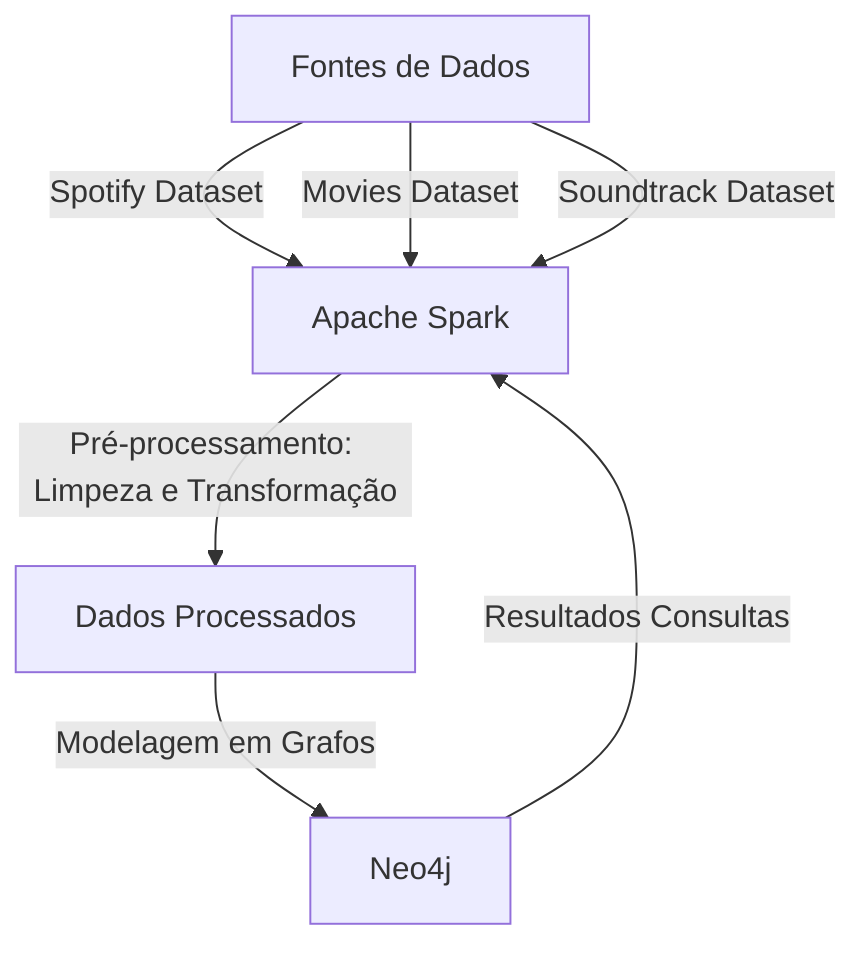
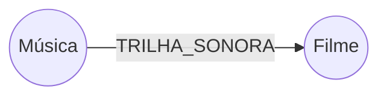
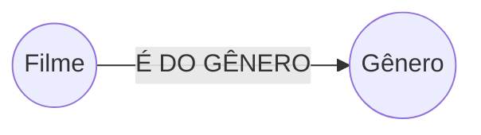
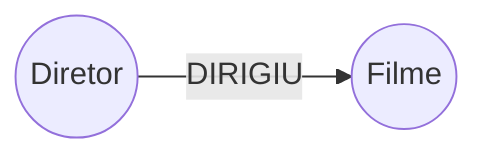
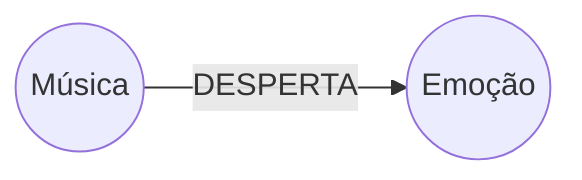
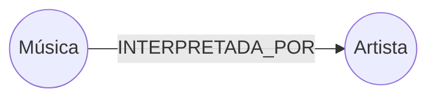
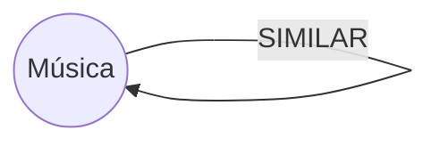
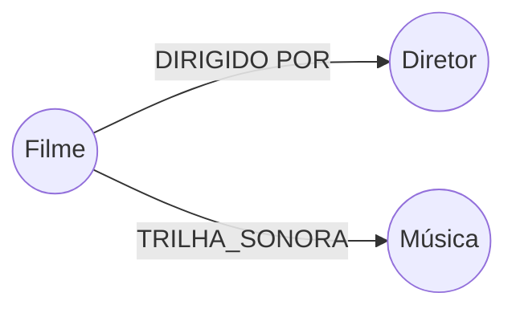

# Projeto de Disciplina - Trilha Sonora de Filmes

Universidade Federal de São Carlos

Curso: Bacharelado em Ciência da Computação de Sorocaba

Disciplina: Processamento Massivo de Dados

Professora: Profa. Dra. Sahudy Montenegro González

---

### Grupo 5

#### Integrantes:

* 770988 - Arthur Naoto Nitto
* 802640 - Beatriz Patricio Santos
* 801695 - Murillo Justino dos Santos

---

### Resumo

O objetivo deste projeto é desenvolver uma aplicação de recomendação de filmes e músicas, tanto separadamente quanto o relacionamento entre ambos. A aplicação será capaz de recomendar músicas relacionadas a um filme específico e vice-versa. Para isso, utilizaremos três bases de dados que contêm informações sobre músicas do Spotify, de filmes e de trlhas sonoras.

### Tecnologias Escolhidas

- **Apache Spark**:  
Será utilizado para o processamento massivo dos dados pois é uma ferramenta poderosa para realizar transformações, limpezas e junções de grandes volumes de dados de forma eficiente, portanto será importante para a etapa de preparação dos dados. Também possui um conector específico para **Neo4j**, ferramenta onde armazenaremos os dados.

- **Neo4j**:  
Será utilizado para modelar os dados em grafos, o que é ideal para mapear as relações entre os filmes, músicas e seus atributos, diferentemente de outros modelos (MongoDB possui dificuldade em mapear relacionamentos e em SQL as operações de JOIN são custosas). Ele também oferece suporte para um grande volume de dados e oferece consultas complexas e rápidas, o que é essencial para a aplicação de recomendação.

### Consultas Definidas
1. Recomendação de músicas baseadas em um filme específico, relacionando o dataset de filmes e o dataset de trilhas sonoras através do atributo (`titulo`) do filme, e com o atributo (`nome`) da música no dataset de músicas, para então acessar também músicas similares através dos atributos (`musicas recomendadas`) do dataset de músicas.
2. Recomendações de músicas similares, utilizando o atributos (`emoção`) e (`músicas similares`) do dataset de músicas.
3. Recomendações de filmes similares, utilizando os atributos (`gênero`) e (`diretor`) do dataset de filmes.
4. Encontrar músicas que tocam em filmes de um diretor específico, usando atributo (`diretor`) do dataset de filmes, relacionando com o datasets de trilhas sonororas.
5. Relaciona emoções à filmes específicos, utilizando a combinação do dataset de filmes e trilhas sonoras através do atributo (`emoção`) do dataset de músicas.

### Fontes de Dados
- **Spotify Dataset**: [Link para o dataset](https://www.kaggle.com/datasets/devdope/900k-spotify)  
  Este dataset contém informações sobre aproximadamente 900 mil músicas disponíveis no Spotify e contém atributos como nome da música, artista, álbum, gênero, emoção, duração, entre outros. Utilizaremos para obter informações detalhadas sobre as músicas e suas características e correlacionar com a outra fonte de dados.
- **The Movies Dataset**: [Link para o dataset](https://www.kaggle.com/datasets/rounakbanik/the-movies-dataset?select=movies_metadata.csv)  
  Esse dataset contém informações em 7 tabelas distintas, mas sua principal tabela (movies_metadata) contém 45 mil filmes, com atributos como nome do filme, gênero, produtora, entre outros. Utilizaremos a tabela citada para obter informações detalhadas sobre filmes, e utilizaremos a tabela credits para obter o nome do diretor de cada produção.
- **Soundtracks of Top 250 IMDb Movies and TV Series**: [Link para o dataset](https://www.kaggle.com/datasets/ravineesh/soundtracks-of-top-250-imdb-movies-and-tv-series)  
  Esse dataset contém informações de 3132 trilhas sonoras de filmes e contém atributos como nome da trilha sonora, nome do filme, compositor, escritor, artista, entre outros. Utilizaremos para fazer uma conexão entre o dataset de filmes com o dataset de músicas.

### Fluxograma do Projeto

### Descrição do Fluxograma
1. **Fontes de Dados**: As três bases de dados serão utilizadas como fontes de informação.
2. **Apache Spark**: O Spark será responsável por processar e limpar os dados, realizando transformações e junções necessárias.
3. **Dados Processados**: Os dados processados pelo Spark serão preparados para a modelagem em grafos.
4. **Neo4j**: Os dados processados serão inseridos no Neo4j, onde serão modelados em grafos para mapear as relações entre filmes, músicas e seus atributos.
5. **Consultas e Recomendações**: Realizar consultas e gerar recomendações de filmes e músicas baseadas nas relações mapeadas.

---

### Desenvolvimento

Durante o desenvolvimento do projeto, a equipe seguiu um pipeline dividido em três etapas principais: **pré-processamento dos dados no Apache Spark**, **modelagem em grafo no Neo4j**, e **execução de consultas Cypher para recomendações**.

### Pré-processamento dos dados

Para pré-processar os dados, inicialmente dividimos os datasets entre os integrantes da equipe para cada um ficar responsável pelo tratamento inicial de um dataset específico, utilizando **Apache Spark** em todo o processo. Como o dataset de filmes é dividido em 7 tabelas, onde duas foram utilizadas no projeto, um dos integrantes se responsabilizou pelo tratamento e união dessas duas tabelas.

Foram realizadas as seguintes operações de tratamento dos dados:

* **No dataframe de Filmes**

    * remoção de filmes sem título;
    * remoção de linhas com data de lançamento mal formada;
    * remoção de colunas que não interessam para o projeto;
    * criação de coluna de identificador a partir da coluna de título;

* **No dataframe de Músicas**

    * remoção de colunas desnecessárias
    * padronização do nome das colunas restantes
    * criação de nova tabela com os dados tratados;
    * criação de coluna de identificador a partir da coluna de nome;

* **No dataframe de Trilhas Sonoras**

    * substituição de valores _"NA"_ por `None` em todas as colunas;
    * remoção de colunas não utilizadas e com vários valores nulos;
    * remoção da marcação _"(uncredited)"_ na coluna `performed_by`;
    * criação de colunas de identificadores das músicas e filmes;

Para facilitar a inserção dos dados no Neo4j foram criados novos dataframes a partir dos dataframes resultantes após limpeza dos dados, são eles:

* dataframe de **filmes** a partir do dataset **movies_metadata**;
* dataframe de **diretores** a partir do dataset **movies_credits**;
* dataframe de **gêneros** por **filme** a partir do dataset **movies_metadata**;
* dataframe de **músicas** do spotify a partir do dataset **spotify_dataset**;
* dataframe de **trilhas sonoras** a partir do dataset **sound_track_imdb_top_250_movie_tv_series**;
* dataframe de **emoções** de músicas a partir do dataframe de músicas do spotify;
* dataframe de **artistas** de músicas a partir do dataframe de músicas do spotify;

Para representar as relações entre os dados de filmes, músicas e trilhas sonoras, optamos por uma modelagem orientada a grafos no Neo4j. Após o processamento, os dados foram inseridos diretamente no Neo4j através da conexão entre ele e o Apache Spark.

Na descrição da limpeza dos dados pode-se ver que para cada dataset foram criadas novas colunas de identificadores para filmes e músicas. A criação dessa coluna foi necessária para relacionar as linhas dos três datasets, dado que eles não possuiam nehuma relação prévia. A maior relação entre eles se dava pelo nome dos filmes (nos datasets de filmes e trilha sonora) e das músicas (nos datasets de músicas do spotify e trilha sonora), porém, como o nome poderia variar em cada dataset, foi aplicado uma função sobre esses dados para criação das novas colunas de identificadores. Foi utilizado uma função para criar o identificador dos filmes e outra para criar o identificador das músicas, mas basicamente o que elas fazem é (as funções podem aplicar todos processo descritos a seguir ou apenas alguns deles):

* remover caracteres não alfa numéricos;
* substituir todas as letras por letras minúsculas;
* remover espaços no início e o no fim do campo;

### Modelagem em Grafo e Relacionamentos

Para representar as relações entre os dados de filmes, músicas e trilhas sonoras, criamos algumas relações entre os seguintes nós (`N`) e as arestas (`r`):

#### 1. Relacionar músicas a filmes (e vice-versa)

A principal conexão entre filmes e músicas se dá por meio das trilhas sonoras. Essas trilhas funcionam como ponte entre os dois domínios:

Essa estrutura permite, por exemplo, consultar todas as músicas que fazem parte de um filme específico ou descobrir em quais filmes uma música aparece.

#### 2. Similaridade entre músicas e entre filmes

Para permitir recomendações baseadas em similaridade, estabelecemos conexões entre entidades do mesmo tipo com base em atributos compartilhados.

**Filmes similares:**

Filmes são conectados entre si quando compartilham características como gênero ou diretor:

**Músicas similares:**

Músicas são conectadas com base em atributos como emoção, artista, gênero ou similaridade a partir dos campos `similar_song_1`, `similar_song_2`, e `similar_song_3`:

#### 3. Músicas presentes em filmes de um diretor específico

A modelagem também permite explorar conexões indiretas. Por exemplo, para encontrar músicas que tocam em filmes dirigidos por um determinado diretor:

Por fim, chegamos no seguinte esquema:

---

### Resultados

Os resultados obtidos demonstraram que há uma grande vantagem em conectar as informações por meio de um modelo em grafo para recomendações. Essa representação possibilita consultas como "Quais músicas estão presentes nos filmes do Christopher Nolan?", "Quais são as emoções mais associadas aos filmes de determinado diretor?" ou "Quais as músicas recomendadas com base no filme "The Wolf of Wall Street"?"

Essa modelagem em grafo mostrou-se altamente flexível e eficiente, permitindo consultas complexas com baixo custo computacional, o que seria mais custoso e menos intuitivo em bancos relacionais. No entanto, foram encontrados desafios na parte da injeção de dados do Apache Spark para o Neo4J.

Nosso esquema resultou em 62K nós e 105K de relacionamentos, o que possibilitou a construção de recomendações mais ricas, como sugerir músicas com base em diretores, gêneros cinematográficos, emoções predominantes ou até mesmo por similaridade entre trilhas sonoras. Além disso, foi possível identificar artistas frequentemente associados a determinados estilos de filmes ou diretores.

---

### Dificuldades

Durante o desenvolvimento, a equipe enfrentou alguns desafios relevantes:

Encontramos limitações no uso da edição gratuita do Databricks, pois ela não permite a persistência de bibliotecas entre sessões, o que exigiu a reinstalação do conector Spark–Neo4j a cada criação de novo cluster e apresentou inconsistência na disponibilidade de algumas versões desse conector, então passamos a utilizar o Free Edition.

Não conseguimos conectar o Databricks Free Edition com o Neo4J por causa das limitações e falta de suporte do primeiro. Por esse motivo, foi-se usado o Apache Spark localmente e o Neo4J via Cloud. 
No entanto, a versão gratuita do Neo4J, enquanto teoricamente suporta dados quase ilimitados, na prática não conseguimos inserir 200 mil dados quando o site travou e o progresso de horas foi perdido. Dessa forma, limitamos propositalmente a quantidade de nós e relações na plataforma para conseguirmos fazer o uso do mesmo.

O pré-processamento dos dados também foi uma etapa trabalhosa, pois lidamos com 3 datasets diferentes (trilhas sonoras, metadados de filmes e de músicas), cada um com estruturas distintas. Portanto, foi necessário tratamento de dados ausentes e padronização cautelosa para minimizar conflitos, especialmente entre nomes de filmes (em trilhas sonoras) e metadados dos filmes, onde foi usado padronização manual e técnicas de normalização textual.

---

