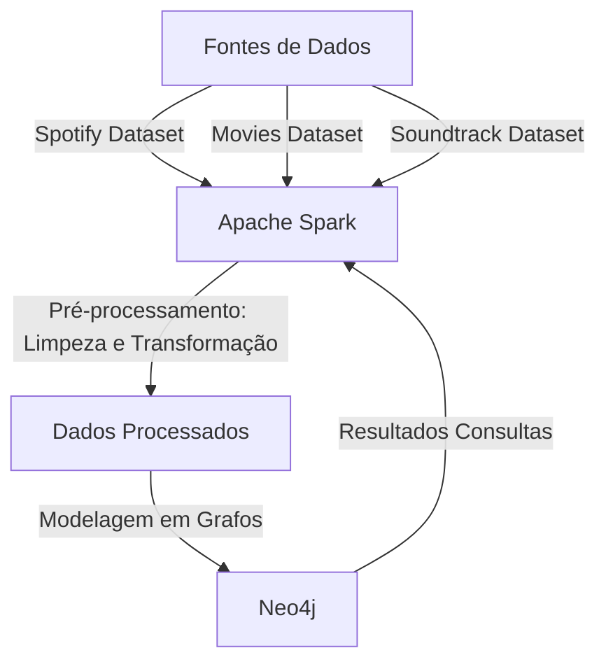
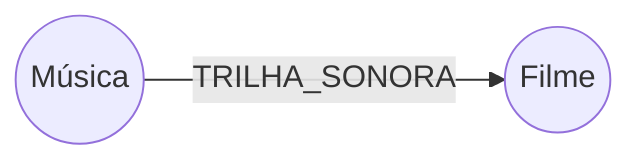
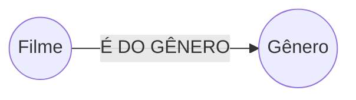
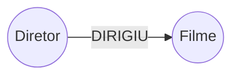
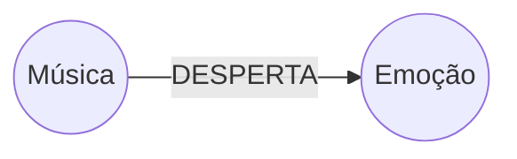
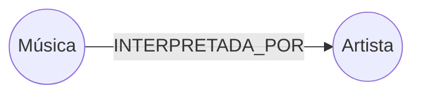
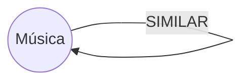
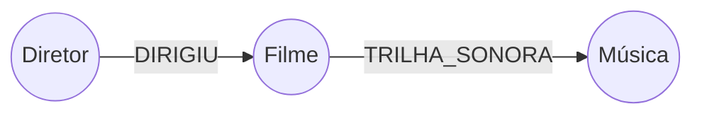

# UFSCAR-CC-So-PMD2025-Grupo05

770988 - Arthur Naoto Nitto

802640 - Beatriz Patricio Santos

801695 - Murillo Justino dos Santos

---
## Objetivo
O objetivo deste projeto é desenvolver uma aplicação de recomendação de filmes e músicas, tanto separadamente quanto o relacionamento entre ambos. A aplicação será capaz de recomendar músicas relacionadas a um filme específico e vice-versa. Para isso, utilizaremos duas bases de dados que contêm informações sobre músicas do Spotify e informações de filmes.

## Tecnologias Escolhidas

- **Apache Spark**:  
Será utilizado para o processamento massivo dos dados pois é uma ferramenta poderosa para realizar transformações, limpezas e junções de grandes volumes de dados de forma eficiente, portanto será importante para a etapa de preparação dos dados.

- **Neo4j**:  
Será utilizado para modelar os dados em grafos, o que é ideal para mapear as relações entre os filmes, músicas e seus atributos, diferentemente de outros modelos (MongoDB possui dificuldade em mapear relacionamentos e em SQL as operações de JOIN são custosas). Ele também oferece suporte para um grande volume de dados e oferece consultas complexas e rápidas, o que é essencial para a aplicação de recomendação.

## Consultas Definidas
1. Recomendação de músicas baseadas em um filme específico, correlacionando o dataset de filmes e o dataset de trilhas sonoras (pelo nome do filme) com o dataset de músicas, para então recomendar músicas similares através dos atributos de músicas similares do dataset de músicas.
2. Recomendações de músicas similares, utilizando atributos diversos (emoção, gênero, explicidade) do dataset de músicas.
3. Recomendações de filmes similares, utilizando atributos diversos (gênero, linguagem, explicidade) do dataset de filmes.
4. Encontrar músicas que tocam em filmes de um diretor específico, usando atributo de diretor do dataset de filmes, atrelado ao datasets de trilhas sonororas.
5. Ligar emoções à filmes específicos, utilizando a combinação do dataset de filmes e trilhas sonoras para atrelar o atributo emoções (do dataset de músicas) à filmes individuais.

## Fontes de Dados
- **Spotify Dataset**: [Link para o dataset](https://www.kaggle.com/datasets/devdope/900k-spotify)  
  Este dataset contém informações sobre aproximadamente 900 mil músicas disponíveis no Spotify e contém atributos como nome da música, artista, álbum, gênero, emoção, duração, entre outros. Utilizaremos para obter informações detalhadas sobre as músicas e suas características e correlacionar com a outra fonte de dados.
- **The Movies Dataset**: [Link para o dataset](https://www.kaggle.com/datasets/rounakbanik/the-movies-dataset?select=movies_metadata.csv)  
  Esse dataset contém informações em 7 tabelas distintas, mas a tabela usada (movies_metadata) contém 45 mil filmes, com atributos como nome do filme, gênero, produtora, entre outros. Utilizaremos para obter informações detalhadas sobre filmes.
- **Soundtracks of Top 250 IMDb Movies and TV Series**: [Link para o dataset](https://www.kaggle.com/datasets/ravineesh/soundtracks-of-top-250-imdb-movies-and-tv-series)  
  Esse dataset contém informações de 3132 trilhas sonoras de filmes e contém atributos como nome da trilha sonora, nome do filme, compositor, escritor, artista, entre outros. Utilizaremos para fazer uma conexão entre o dataset de filmes com o dataset de músicas.

## Fluxograma do Projeto

## Descrição do Fluxograma
1. **Fontes de Dados**: As três bases de dados serão utilizadas como fontes de informação.
2. **Apache Spark**: O Spark será responsável por processar e limpar os dados, realizando transformações e junções necessárias.
3. **Dados Processados**: Os dados processados pelo Spark serão preparados para a modelagem em grafos.
4. **Neo4j**: Os dados processados serão inseridos no Neo4j, onde serão modelados em grafos para mapear as relações entre filmes, músicas e seus atributos.
5. **Consultas e Recomendações**: Realizar consultas e gerar recomendações de filmes e músicas baseadas nas relações mapeadas.

---

## Desenvolvimento

Durante o desenvolvimento do projeto, a equipe seguiu um pipeline dividido em três etapas principais: **pré-processamento dos dados no Apache Spark**, **modelagem em grafo no Neo4j**, e **execução de consultas Cypher para recomendações**.

Inicialmente, os três datasets foram importados e tratados utilizando Apache Spark. Foram realizadas operações de limpeza como remoção de campos nulos, padronização de nomes de filmes e músicas, e transformação de formatos de dados para permitir junções eficientes entre as bases. Também foi feita a extração somente das colunas relevantes para as consultas, como gênero, diretor, emoção e nome do artista.

Para representar as relações entre os dados de filmes, músicas e trilhas sonoras, optamos por uma modelagem orientada a grafos no Neo4j. 
Após o processamento, os dados foram inseridos diretamente no Neo4j através da conexão entre ele e o Databricks. 

### Modelagem em Grafo e Relacionamentos

Para representar as relações entre os dados de filmes, músicas e trilhas sonoras, criamos algumas relações entre os seguintes nós (`N`) e as arestas (`r`):

#### 1. Relacionar músicas a filmes (e vice-versa)

A principal conexão entre filmes e músicas se dá por meio das trilhas sonoras. Essas trilhas funcionam como ponte entre os dois domínios:

Essa estrutura permite, por exemplo, consultar todas as músicas que fazem parte de um filme específico ou descobrir em quais filmes uma música aparece.

#### 2. Similaridade entre músicas e entre filmes

Para permitir recomendações baseadas em similaridade, estabelecemos conexões entre entidades do mesmo tipo com base em atributos compartilhados.

**Filmes similares:**

Filmes são conectados entre si quando compartilham características como gênero ou diretor:

**Músicas similares:**

Músicas são conectadas com base em atributos como emoção, artista, gênero ou similaridade a partir dos campos `similar_song_1`, `similar_song_2`, e `similar_song_3`:

---

#### 3. Músicas presentes em filmes de um diretor específico

A modelagem também permite explorar conexões indiretas. Por exemplo, para encontrar músicas que tocam em filmes dirigidos por um determinado diretor:

---

## Resultados

Os resultados obtidos demonstraram que há uma grande vantagem em conectar as informações por meio de um modelo em grafo para recomendações. Essa representação possibilita consultas como "Quais músicas estão presentes nos filmes do Christopher Nolan?", "Quais são as emoções mais associadas aos filmes de determinado diretor?" ou "Quais as músicas recomendadas com base no filme "The Wolf of Wall Street"?"

Essa modelagem em grafo mostrou-se altamente flexível e eficiente, permitindo consultas complexas com baixo custo computacional, o que seria mais custoso e menos intuitivo em bancos relacionais.

Nosso esquema resultou em 123K nós e ? de relacionamentos, o que possibilitou a construção de recomendações mais ricas, como sugerir músicas com base em diretores, gêneros cinematográficos, emoções predominantes ou até mesmo por similaridade entre trilhas sonoras. Além disso, foi possível identificar artistas frequentemente associados a determinados estilos de filmes ou diretores.

---

## Dificuldades

Durante o desenvolvimento, a equipe enfrentou alguns desafios relevantes:

Encontramos limitações no uso da edição gratuita pois ela não permite a persistência de bibliotecas entre sessões, o que exigiu a reinstalação do conector Spark–Neo4j a cada criação de novo cluster e apresentou inconsistência na disponibilidade de algumas versões desse conector, então passamos a utilizar o Free Edition.
Após alguns testes, percebemos que a limitação de armazenamento da versão Free impactava nas nossas consultas, pois para ficar dentro do limite de 200 mil nós e relações, tivemos que reduzir nosso dataset, e consequentemente as recomendações eram incompletas. Como alternativa na reta final do projeto, utilizamos o Free-Trial de 14 dias para realizar as consultas finais com o dataset completo e validar os resultados.
Houve divergências entre nomes de filmes nas trilhas sonoras e nos metadados dos filmes, o que exigiu padronização manual e uso de técnicas de normalização textual.
O pré-processamento dos dados também foi uma etapa trabalhosa, pois lidamos com 3 datasets diferentes (trilhas sonoras, metadados de filmes e de músicas), cada um com estruturas distintas portanto foi necessário tratamento de dados ausentes e padronização.

---

